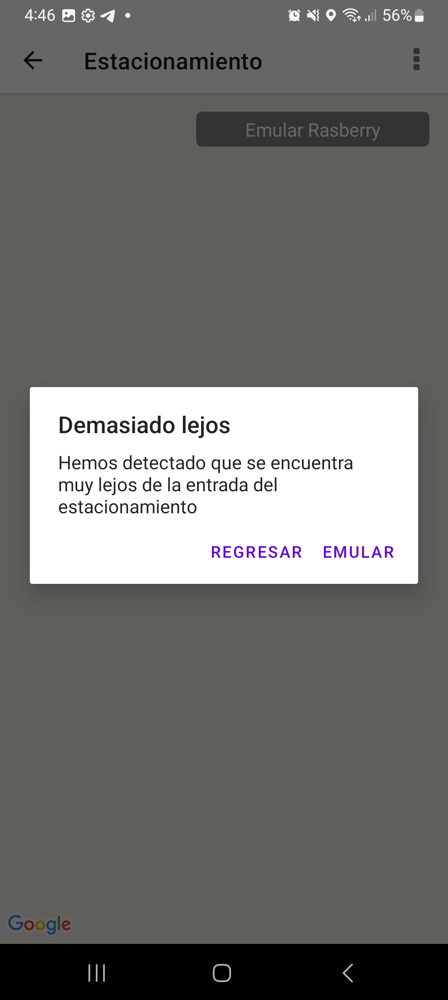
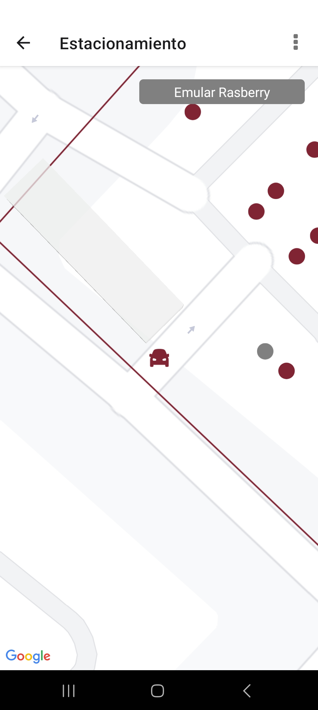

## Uppita Parking
---

Showcase react-native application, for allowing parking operation such as.

- Register vehicules.
- Get into a parking.
- Select a parking slot.
- Confirm slot.
- Compute payment based on entry date and hourly rate price.
- Perform a payment (Testing) using Stripe platform.
- Documentation: In spanish (requested by client).


This application is meant to work with a rasberry device installed on the parking, but the application has options to emulate those functions.

### Implementations:
---

  - **react-native**: This application is a react-native project written in Javascript.
  - **Firebase**:   This application uses Firebase services (Firestore, Functions, Autentication).
  - **Google signin**   This application allows signin with Google Account.
  - **Stripe**:   This application has an Stripe integration.
  - **Google Maps**: This application used google maps, as well **Directions API**.


### Prerequisites
---

  - setup react-native enviroment: https://reactnative.dev/docs/environment-setup
  - Put a valid google-services.json at android/app/ directory


### Install and start application
---

```
  npm install
  npx react-native run-android
```

### Generate APK (Windows)
---

Generate release bundle
```
npx react-native bundle --platform android --dev false --entry-file index.js --bundle-output android/app/src/main/assets/index.android.bundle --assets-dest android/app/src/main/res
```

Generate release apk
```
cd android
.\gradlew.bat assembleRelease
```

### Troubleshooting
---

#### **Unable to run aplication**
try to clean android project, repeat until get a sucessfull clean

  ```
  cd android
  .\gradlew.bat clean
  ```

#### **Duplicated Resources** 
when building final release apk: delete all images in **android/app/src/res/drawable\*** and repeat step "Generate APK"


### Screenshots






